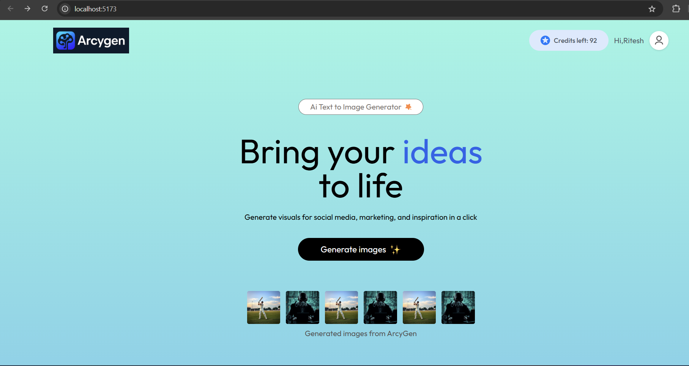
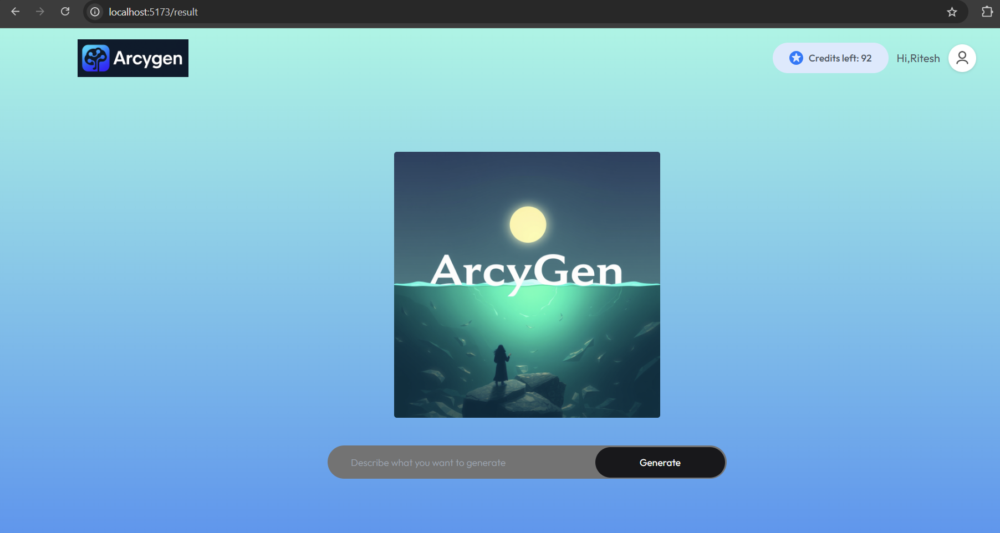
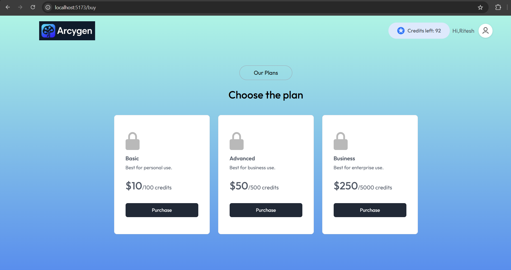

# ArcyGen

**ArcyGen** is a modern AI-powered SaaS application that allows users to generate stunning images from text prompts in seconds. Built with a React frontend and Node.js/Express backend, ArcyGen offers a seamless, credit-based user experience with authentication, image generation, and a beautiful, responsive UI.

---

## Features

- ✨ **AI Image Generation:** Turn your imagination into visuals using advanced AI models.
- 👤 **User Authentication:** Secure login and registration with JWT-based authentication.
- 💳 **Credit System:** Users can buy credits to generate images, with real-time credit tracking.
- 🖼️ **Image Gallery:** View and download generated images.
- 💬 **Testimonials:** See what users are saying about ArcyGen.
- 📱 **Responsive Design:** Works beautifully on desktop and mobile.
- 🌈 **Modern UI:** Built with Tailwind CSS and React for a sleek, fast experience.

---

## Tech Stack

- **Frontend:** React, Tailwind CSS, Vite
- **Backend:** Node.js, Express
- **Database:** MongoDB
- **Authentication:** JWT
- **Other:** Framer Motion, React Router

---

## Project Structure

```
AI_SAAS_APP/
  ├── Client/           # React frontend
  │   ├── src/
  │   │   ├── assets/   # Images and asset management
  │   │   ├── components/ # Reusable UI components
  │   │   ├── context/  # React context for global state
  │   │   ├── pages/    # Main app pages (Home, Result, BuyCredit)
  │   │   └── ...       
  │   └── ...
  └── server/           # Node.js backend
      ├── controllers/  # Route controllers
      ├── models/       # Mongoose models
      ├── routes/       # API routes
      └── ...
```

---

## Getting Started

### Prerequisites

- Node.js (v16+ recommended)
- npm or yarn
- MongoDB (local or Atlas)

### 1. Clone the Repository

```bash
git clone https://github.com/yourusername/arcygen.git
cd arcygen
```

### 2. Setup the Backend

```bash
cd server
npm install
```

- Create a `.env` file in `/server` with:
  ```
  MONGODB_URL=your_mongodb_connection_string
  JWT_SECRET=your_jwt_secret
  PORT=5000
  ```

- Start the backend:
  ```bash
  npm start
  ```

### 3. Setup the Frontend

```bash
cd ../Client
npm install
```

- (Optional) Create a `.env` file in `/Client` if you want to set a custom backend URL:
  ```
  VITE_BACKEND_URL=http://localhost:5000
  ```

- Start the frontend:
  ```bash
  npm run dev
  ```

- Visit [http://localhost:5173](http://localhost:5173) in your browser.

---

## Usage

1. **Register/Login:** Create an account or log in.
2. **Buy Credits:** Purchase credits to generate images.
3. **Generate Images:** Enter a prompt and let ArcyGen create unique images for you.
4. **Download/Share:** Save or share your creations.

---

## API Documentation

### Base URL
```
http://localhost:4000
```

### User Routes

#### Register
- **POST** `/api/user/register`
- **Body:** `{ name, email, password }`
- **Response:** User object, JWT token

#### Login
- **POST** `/api/user/login`
- **Body:** `{ email, password }`
- **Response:** User object, JWT token

#### Get User Credits
- **GET** `/api/user/credits`
- **Headers:** `Authorization: Bearer <token>`
- **Response:** `{ credits: number }`

#### Start Payment (Razorpay)
- **POST** `/api/user/pay-razor`
- **Headers:** `Authorization: Bearer <token>`
- **Body:** `{ amount }`
- **Response:** Razorpay order details

#### Verify Payment (Razorpay)
- **POST** `/api/user/verify-razor`
- **Body:** `{ order_id, payment_id, signature }`
- **Response:** Payment verification result

---

### Image Routes

#### Generate Image
- **POST** `/api/image/generate-image`
- **Headers:** `Authorization: Bearer <token>`
- **Body:** `{ prompt }`
- **Response:** `{ imageUrl }` (or image data)

---

**Note:**  
- All protected routes require a valid JWT token in the `Authorization` header.
- Adjust the base URL if deploying to production.

---

## Screenshots

### Home Page


### Result Page


### Pricing/Buy Credits Page


---

## Contributing

Pull requests are welcome! For major changes, please open an issue first to discuss what you would like to change.

---

## License

[MIT](LICENSE)

---

## Acknowledgements

- [OpenAI](https://openai.com/) for AI inspiration
- [Tailwind CSS](https://tailwindcss.com/)
- [Framer Motion](https://www.framer.com/motion/)
- [MongoDB](https://www.mongodb.com/)

---

**Enjoy using ArcyGen! If you like it, give the repo a star ⭐** 